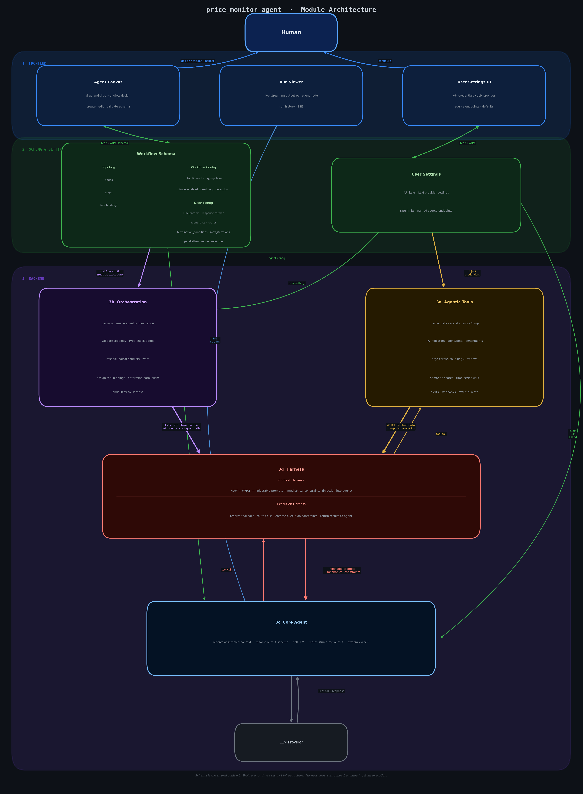

# price_monitor_agent — Architecture Plan

## Module Overview

Five layers. Schema is the shared contract between frontend and backend. No layer owns another.

| Layer | Role |
|---|---|
| **1. Frontend** | Human-facing interaction, canvas, run observation |
| **2. Schema & Settings** | Persistent workflow definitions and global config |
| **3a. Agentic Tools** | Atomic runtime capabilities agents call on demand |
| **3b. Orchestration** | Reads schema, wires agent topology, validates, executes |
| **3c. Core Agent** | Individual agent template — pure executor |
| **3d. Harness** | Assembles and injects context (Context Harness); manages agent tool calls (Execution Harness) |

---

## Module Definitions

### 1. Frontend

Not decorative. Three active responsibilities:

- **Receive user actions** — canvas interactions, run triggers, config changes
- **Read/write schema** — renders the current schema as an interactive canvas; edits are immediately reflected back to the schema
- **Communicate with backend** — REST for CRUD operations, SSE for streaming run output

Menu items:
- Schema: load, open, create schema
    - Canvas, after opening a schema: drag-and-drop agent node composition, edge wiring, per-node configuration
- Runs Records: run history
    - Runs Viewer: live streaming output per agent node, 
- User Settings UI: API keys, LLM provider settings, source endpoints

---

### 2. Schema & Configs

The persistent "saved" layer. Three distinct artifacts.

**Workflow Schema** (per-workflow file, YAML or JSON) — three named panels:

**Topology** - consumed by Orchestration to create a live, executable agent graph.
- Nodes: node types and their roles in the graph
    - single agent nodes: instance of core agent with its own config
    - agent group nodes: a group of potential sub agents, commanded by an upstream single agent node planner. The agent group also has its own config, such as max parallel agents, and tool call authorization.
    - tool nodes: tools that can be called by agents when connected with edges

- Edges: directed data flow between nodes (output type → input slot, direction, edge types)
    - Passing data among agents: data flow between agent nodes
    - Tool callings: which tools each node is permitted to call
    - Synchronization: synchronization between two agent nodes or agent group nodes. When two such nodes linked, they must wait each other to finish their tasks before move on. In front end, This is non directional edge.

**Workflow Config** — consumed by Orchestration at execution time
- total_timeout: maximum wall-clock time for the full workflow run
- logging_level: verbosity of run logging. it can be <NONE|ERRORS|INFO|CRITICAL_INFO>
- trace_enabled: whether llm response tracing is captured and returned to the frontend.
- dead_loop_detection: whether dead cyclic execution is detected and aborted

**Node Config** — consumed by Core Agent per node instance as agent config
- Model selection: per-node LLM model selection. In front end, this is a dropdown menu, implemented just like the no-code-workflow project's model detection and selection.
- LLM params: temperature, max tokens. max tokens is optional and default to max.
- Response format: output schema enforcement.
- Agent rules: behavioral constraints and instructions specific to the node. This is rules prompt injection.
- Retries: retry count, backoff policy, fallback behavior
- Termination conditions: criteria for considering the node's task complete
- Max iterations: upper bound on agentic loop steps within the node

Creation path: when no schema is loaded, frontend provides a blank canvas; the user builds a workflow and saves it as a schema file. Backend reads that file and orchestrates from it.

Modification path: when a schema is loaded, or developer provided default or demo schema, frontend renders it as an editable canvas. Edits write back to the schema. Backend always reads the current schema state at execution time.

Schema is the converging point between canvas and orchestration.

**User Settings** (global, persistent)
- Named API credentials: exchange APIs, social media APIs, news APIs, etc. 
- LLM provider settings: providers and their API keys, and available model registry; Core Agent instances select and call the LLM provider per schema node config (model selection). the gold standard implementation is the no-code-workflow project's llm settings and model detection and selection.
- Global defaults: temperature, token limits, rate limit profiles and others that should have a global default value for safety.

Feeds to: Orchestration (user settings read at execution time), Agentic Tools (API credentials injected per tool call), Core Agent (LLM provider config injected per instance)

---

### 3a. Agentic Tools

Atomic capabilities that agents call at runtime via LLM tool-call protocol. Not infrastructure; invoked on-demand by agent decisions filtered by execution harness.

**Data Acquisition**
- Market data: OHLCV candles, order book snapshots, trade ticks, funding rates
- Social media: posts, threads, account timelines (any platform, not hardwired)
- News and filings: headlines, full articles, SEC filings, earnings transcripts
- Macro and alternative data: economic indicators, sentiment indices, on-chain data
- Template: This tool should storage and select what source type that is so that a correct fetching parameters are passed in.

**Technical Analysis**
- Technical indicators: RSI, MACD, Bollinger Bands, ATR, VWAP, moving averages. this is not a full list. read TA-lib for more.
- Statistical metrics: alpha, beta, Sharpe ratio, drawdown, correlation. this is not a full list.
- Signal detection: pattern detection, threshold crossings, supports, divergence. this is not a full list. This is a more abstracted/higher level concept.
- Benchmark computation: index comparison, relative performance

**Text Analysis**
- Large corpus handling: chunking, windowing, deduplication, format normalization
- Retrieval: semantic search over stored data or documents
- Extraction: 
    Named entity recognition: tickers, companies, people, dates, numbers
    Relationship extraction: who said what about which asset
    Claim extraction: pull factual assertions out of prose
- Classification: Classify the text into categories.
- Scoring
    Sentiment scoring: per-document and per-entity level (not just corpus-level)
    Relevance scoring: how relevant is this text to a given asset or topic
    Credibility / source weighting
    Or other type of scoring. This is not a full list.
- Summarization:
    Single document summarization
    Multi-document synthesis: reconcile across conflicting sources
    Delta summarization: what changed since last run
- Cross-modal alignment:
    Linking text signals to TA or Data Acquisition tools
    Anchoring text claims to structured data already fetched by Data Acquisition tools

**Alert dispatch**: webhook, email, Telegram
**Write output**: structured export, append to dataset

Each tool is addressable by name in the schema, parameterizable from the schema node config, and returns typed output. API credentials for each tool are injected at runtime from User Settings.

---

### 3b. Orchestration

Reads a schema and produces a live, executable agent graph.

Responsibilities:
- Parse schema → resolve agent orchestration (nodes and edges)
- Read user settings from User Settings: API credentials, LLM provider config, rate limits
- Type-check edges: verify output type of upstream node is compatible with input slot of downstream node
- Detect and resolve or hard-warn on logical conflicts: cycles, unreachable nodes, type mismatches, missing tool bindings
- Assign tool bindings to each agent node as declared in the schema
- Determine execution order and parallelism (parallel-capable branches run concurrently)
- Instantiate and connect Core Agent instances
- Pass **HOW** instructions to the Harness for each agent: context structure, scope, window, guardrail rules, state passing behavior

Orchestration is responsible for the correctness of the topology before any LLM call is made.

---

### 3c. Core Agent

The template for a single agent instance on the canvas. Every node in the schema becomes one Core Agent instance at runtime.

Responsibilities:
- Receive node config (agent config) from Workflow Schema (Node Config panel): LLM params, response format, agent rules, retries, termination conditions, max iterations, parallelism, model selection
- Receive LLM provider settings from User Settings (provider endpoint, API keys); provider is selected per schema node config (model selection)
- Receive fully assembled context from the Harness (injectable prompts + mechanical constraints)
- Execute the LLM call against the configured provider
- Issue tool calls to Harness (Execution Harness) when the LLM invokes a tool; receive tool results back
- Return structured, typed output to Orchestration
- Stream intermediate output back to Frontend via SSE

Configurable per schema node:
- LLM model and provider
- Temperature, max tokens
- Output format and schema enforcement
- Retry policy and fallback behavior
- Tool call authorization: which tools each subagent is permitted to call

Core Agent does not manage its own context. It does not decide what data to include or how to structure prompts. It is a pure executor.

### 3c. Agent Group

The group of potential sub agents, expectedly commanded by an upstream single agent node planner. The agent group also has its own config, such as max parallel agents, and tool call authorization. This group is number and structure vague for the user, but decided by the planner agent.

Responsibilities of the planner agent:
- Decide the number and EXACT structure of the agents in the group.
- Assign roles and tasks for the subagents.
- Provide context and instructions for the subagents.
- Provide context harness for the subagents.

Responsibilities:
- Receive node config (agent config) from Workflow Schema (Node Config panel): LLM params, response format, agent rules, retries, termination conditions, max iterations, parallelism, model selection
- Receive LLM provider settings from User Settings (provider endpoint, API keys); provider is selected per schema node config (model selection)
- Receive fully assembled context from the Harness (injectable prompts + mechanical constraints)
- Execute the LLM call against the configured provider
- Issue tool calls to Harness (Execution Harness) when the LLM invokes a tool; receive tool results back
- Return structured, typed output to Orchestration
- Stream intermediate output back to Frontend via SSE

Configurable per schema node:
- LLM model and provider
- Temperature, max tokens
- Output format and schema enforcement
- Tool call authorization: which tools each subagent is permitted to call
- Retry policy and fallback behavior
- Group config: max parallel agents, tool call authorization etc mentioned in the schema node config.
- Group state: a shared state for the group. This is a shared memory and context between the agents in the group.
- Min and Max of agents in the group: the minimum and maximum number of agents in the group.
- Proposed group schema: a schema that is enforced in this group. User can select from <PARALLEL|SEQUENTIAL|PYRAMID|DEFAULT> . If default, the structure is entirely decided by the planner agent. If pyramid, there should be one or multiple top agents, and multiple sub-sub agents with one or multiple layers. the detail is decided by the planner agent. If parallel or sequential, the number of parallel or sequential agents is decided by the planner agent.

The outgoing calls should also pass through the execution harness.

---

### 3d. Harness

Sits between Orchestration, Agentic Tools, and Core Agent. This is the converging point between agents and outside world.  Two subsets: Context Harness and Execution Harness.

**Context Harness**

The Harness is where context engineering, state management, prompt/instruction injection, and guardrails are implemented — not inside the agent.

Takes in from **Orchestration** (HOW):
- Context structure: which slots to fill, in what order
- Scope and window: time range, record count, token budget
- State: values passed from upstream agents or persisted across turns
- Guardrail rules: content filters, value constraints, output validation criteria

Takes in from **Agentic Tools** (WHAT):
- Fetched data: market data, social posts, news, computed analytics
- Retrieved content: chunked documents, windowed time series

Produces for Core Agent:
- **Injectable prompts**: system prompt, user prompt, few-shot examples, retrieved context — fully assembled, scoped, and token-budgeted
- **Mechanical constraints**: enforced output schema, token limit, guardrail checks applied before and after LLM call, state to inject into next turn

**Execution Harness**

Manages all outbound tool calls issued by Core Agent during execution.

- Receives tool calls from Core Agent
- Routes tool calls to the appropriate Agentic Tool (3a)
- Enforces execution constraints: rate limits, call budget, output validation
- Returns tool results to Core Agent

The Harness bridges the abstract (schema-defined context rules from Orchestration) and the concrete (actual data from Tools) into something a Core Agent instance can execute against.

---

## Human ↔ Module Interaction Diagram

---

## Key Design Decisions

**Schema as contract.** Frontend creates or modifies it; backend executes it. Neither layer owns the schema — it is the shared artifact.

**Tools are runtime calls, not infrastructure.** What data to fetch, when, and from where is an agent decision at runtime, not a deploy-time configuration.

**Harness separates context engineering from execution.** Core Agent is a pure LLM executor. All decisions about what context to build, how to scope it, what guardrails to apply, and what state to pass live in the Harness — driven by Orchestration's HOW and Tools' WHAT.

**Orchestration owns topology correctness.** Conflict resolution, type checking, and wiring happen in Orchestration before any LLM call. Agents receive a valid, pre-resolved execution structure.

**Behavior is schema-defined, not mode-hardwired.** Whether a workflow is a live monitor, a research pipeline, or a hybrid is entirely determined by what the user builds in the canvas and saves as a schema. The system has no built-in modes.

---

## Deliverables

- A complete and working implementation of the plan IN THIS PROJRECT FOLDER, including all elements.
- A GUI that I can interact with
- A local entry point that I can run the workflow by simply clicking run, rather than using command line and flags

---

## End to end testing cases

- Create a simple schema, load it, and run it.
- Create a complex schema, load it, and run it.
- Create a sequential agent schema, that varies on configs, and run it.

this is not a full list. you are allowed to create 10 test cases at total. use the .env openrouter key. it has 100$ budget. use cheap but reliable model to run. 